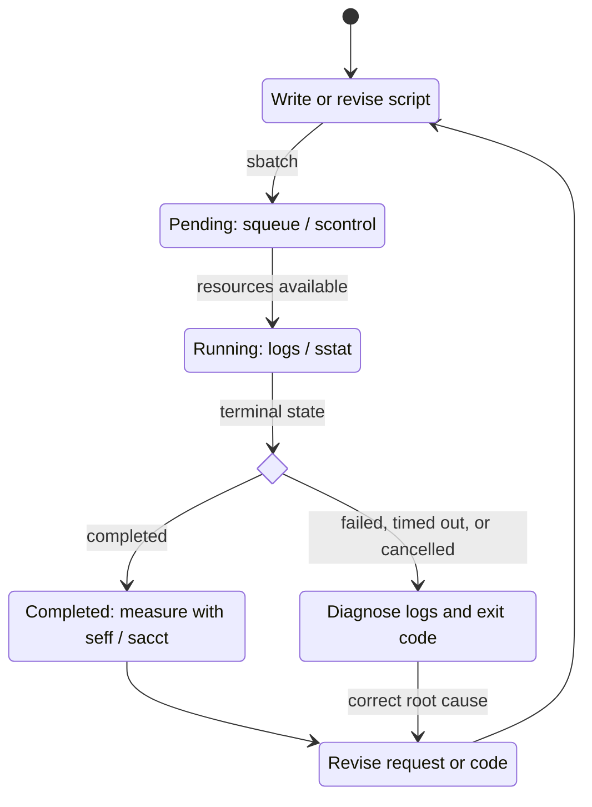

  

    
Fritsche Lab · Practical computing guide

    <h1>SLURM Playbook</h1>
    
From one correct local task to right-sized, observable, recoverable parallel computing.

    

      <a class="btn btn-maize" href="{{ site.baseurl }}">Start here</a>
      <a class="btn btn-outline-light" href="{{ site.baseurl }}">See how it works</a>
      <a class="btn btn-outline-light" href="{{ site.baseurl }}">Command lookup</a>
    

  

  

This is the lab reference to reach for when you have a concrete question: *How many CPUs should I request? Why is my job pending? How do I rerun only task 11? Where should the combine step run?*

If you can already run a command in a Unix shell, the guide will help you move it into a single-node CPU job or array on U-M's SLURM clusters. It covers serial and threaded programs, single-node process pools, independent work units, one fan-in stage, accounting, and recovery. For MPI, multi-node jobs, GPUs, cluster administration, or project-specific compliance decisions, start with ARC or the appropriate specialist instead.

{: .key }
A good SLURM workflow is **measurable, modular, and recoverable**. Treat each resource request as a hypothesis: pilot it, inspect the evidence, and revise it.

## Start with the problem in front of you

  <a class="lookup-card" href="{{ site.baseurl }}"><strong>CPU or array?</strong>Decide whether the program is serial, threaded, multi-process, or many independent repetitions.</a>
  <a class="lookup-card" href="{{ site.baseurl }}"><strong>Right-size a request</strong>Use representative pilots, <code>seff</code>, <code>sacct</code>, MaxRSS, elapsed distributions, and thread settings.</a>
  <a class="lookup-card" href="{{ site.baseurl }}"><strong>Parallelize repeated work</strong>Put one stable work unit per manifest row and map rows to array task IDs.</a>
  <a class="lookup-card" href="{{ site.baseurl }}"><strong>Chain pipeline stages</strong>Fan out with an array, then fan in only after every upstream element succeeds.</a>
  <a class="lookup-card" href="{{ site.baseurl }}"><strong>Diagnose a failure</strong>Follow the evidence in order: state/reason → logs → exit code → resources → environment → paths/I/O.</a>
  <a class="lookup-card" href="{{ site.baseurl }}"><strong>Inspect the working example</strong>See how the manifest, worker, safety guard, submission wrappers, and result files fit together.</a>

## The job lifecycle

{: .caution }
The scheduler is not the debugger. SLURM tells you **where to look** through state and reason; the application log and exit code tell you what the process actually did.

## Six operating principles

  
1<strong>Prove one task locally.</strong> Prefer a small or synthetic smoke test.

  
2<strong>Request only CPUs the code can use.</strong> Allocating CPUs does not make serial code parallel.

  
3<strong>Tune from distributions.</strong> Use <code>seff</code> and array-wide <code>sacct</code>, not one easy task.

  
4<strong>Represent work in a stable manifest.</strong> One auditable row should always mean the same task.

  
5<strong>Throttle arrays and use unique logs.</strong> Protect account limits and shared storage.

  
6<strong>Aggregate after success; rerun only failures.</strong> Preserve completed work and recover at task granularity.

## A working first path

1. Open [Start Here]({{ site.baseurl }}) and run one synthetic manifest row locally.
2. Run the complete scheduler-free test and confirm the documented `PASS` line.
3. Validate the submission command with `--dry-run`, then perform the small Great Lakes acceptance run when you have an account and partition.

The worked example requires Bash 3.2+ and Python 3.10+. A SLURM account is not needed for the local checkpoints.

{: .cluster }
The example is tested on **Great Lakes**. You can use the same scheduler pattern on Armis2 after checking its current account, partition, storage, billing, and sensitive-data rules in the [U-M Cluster Reference]({{ site.baseurl }}); a duplicate training run is not needed.

## Optional downloads

- [SLURM tutorial slide deck]({{ site.baseurl }}/assets/downloads/slurm-tutorial-slides.pdf)
- [SLURM session cheatsheets]({{ site.baseurl }}/assets/downloads/slurm-session-cheatsheets.pdf)
- [Runnable example pipeline ZIP]({{ site.baseurl }}/assets/downloads/slurm-example-pipeline.zip)

The ZIP expands to a directory named `slurm-example-pipeline/`. The PDFs are teaching aids; the web pages and tested example are the versions we keep current.

## Improve this resource

If a command is unclear, an example fails, or a U-M policy appears outdated, [open an issue](https://github.com/FritscheLab/slurm-playbook/issues/new). Include the page and non-sensitive evidence, and link an official policy source when reporting policy drift.
