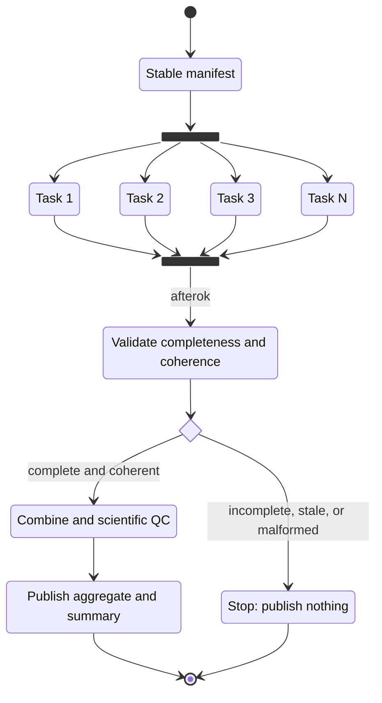

# Dependencies and recovery

A common pipeline shape is **fan out** to independent workers, then **fan in** to a combining, QC, or reporting step.



## Capture job IDs safely

Use `--parsable` so submission commands return machine-readable job IDs. The worked wrapper handles that plumbing and prints both IDs with the result directory:

```bash
export SLURM_ACCOUNT='<your-account>'
export SLURM_PARTITION='<your-partition>'
submission=$(./scripts/submit_pipeline.sh \
  --account="$SLURM_ACCOUNT" \
  --partition="$SLURM_PARTITION" \
  --max-concurrent 8)

printf '%s\n' "$submission"

array_job=${submission#array_job=}
array_job=${array_job%% *}
results_dir=${submission#* results_dir=}
```

Inside the wrapper, the combine submission uses `--dependency=afterok:<array_job_id>`. That makes the downstream job eligible only after every element represented by the base array job ID succeeds. The last three lines save the returned run context for later accounting or recovery commands.

{: .key }
SLURM checks completion and exit status. The combine script itself can perform complex logic—schema validation, missing-task detection, statistical correction, aggregation, plotting, and report generation.

## Make the combine step defensive

Before producing a final file, the combine stage should verify:

- every expected manifest task has exactly one result;
- task IDs in files match their filenames and manifest rows;
- files are non-empty and parseable;
- outputs were produced for the current run, not silently inherited from an old run;
- scientific QC passes;
- the write is atomic so a partial final file is not mistaken for success.

## Diagnose first, rerun second

Use allocation-level accounting to find failed array elements:

```bash
sacct -nX -P -j "$array_job" -o JobIDRaw,State,ExitCode
```

Then inspect each element's state, exit code, and task-specific log. The helper reports the failed terminal elements and prints a guarded recovery command:

```bash
./scripts/rerun_failed.sh "$array_job" --results-dir "$results_dir"
```

After correcting the root cause, run the suggested `submit_pipeline.sh` command to rerun only those IDs and schedule a replacement combine job. Preserve successful results unless the correction changes their scientific validity. When code, inputs, or parameters changed globally, a full clean rerun may be the correct choice.

## Related dependency types

This playbook uses `afterok` because aggregation should wait for successful upstream work. SLURM also provides types such as `afterany`, `afternotok`, and `aftercorr`. Use them only when their semantics match the workflow; avoid a cleanup or notification pattern that accidentally masks a failed scientific stage.

## When raw SLURM becomes awkward

Raw fan-out/fan-in is transparent and portable, but job-ID plumbing, retries, per-process resources, and larger directed acyclic graphs become tedious. That is the point to consider [Nextflow, Snakemake, or another workflow layer]({{ site.baseurl }}).
