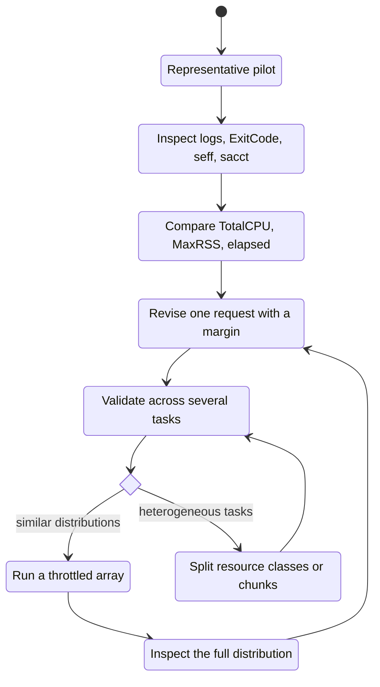

# Resource right-sizing

CPU, memory, walltime, and concurrency are not decorations in a batch script. Together they define the envelope the scheduler must place and the account may be charged for.

## The tuning loop



## CPU

Ask: **Can one worker create useful threads or child processes?**

- Serial worker: request one CPU.
- Threaded or local process-pool worker: request `N` CPUs and configure the program for `N` threads or workers.
- Independent repetitions: use many one-worker array tasks, not one giant threaded allocation.

A practical approximation is:

```text
CPU efficiency ≈ TotalCPU / (Elapsed × AllocCPUS)
```

In one accounting example from the [teaching deck]({{ site.baseurl }}/assets/downloads/slurm-tutorial-slides.pdf), four cores were allocated for about 43 seconds, while only about 42 CPU-seconds were used. That is roughly one fully used CPU and indicates that four allocated cores were not helping. This is separate from the runnable synthetic pipeline. Low CPU can also reflect I/O wait, so check context before reducing CPUs.

## Memory

Ask: **What did representative tasks actually peak at?**

Use `MaxRSS` across multiple tasks and inspect the `.batch` step when the allocation row is blank:

```bash
sacct -j JOB_ID --units=G \
  -o JobIDRaw,State,Elapsed,AllocCPUS,ReqMem,MaxRSS,ExitCode
```

Replace `JOB_ID` with the job ID printed when you submitted the representative task.

Choose a margin based on variability and the cost of failure—not an automatic order of magnitude. Look at the median, upper tail, and largest legitimate outliers.

If the largest tasks are much bigger than the rest, do not size every task for the single largest outlier. Split the manifest into small/medium/large resource classes or reduce chunk size.

## Walltime

Walltime is a hard upper limit. Use a credible upper-tail runtime plus startup and I/O variability.

- Short, accurate limits generally fit more scheduling opportunities.
- A `TIMEOUT` means the limit was insufficient, but first check whether the process stalled.
- Long fragile work should be split or checkpointed.
- Re-profile when sample size, software version, algorithm, or input representation changes.

## Concurrency

Array concurrency is also a resource request. Start conservatively:

```bash
sbatch --array=1-24%8 array.sbatch
```

The `%8` means no more than eight elements run simultaneously. Lower the cap when each task reads the same large input, writes many small files, or competes for a shared service.

## Interpreting common evidence

| Evidence | Likely interpretation | Next action |
|---|---|---|
| Low CPU; one thread visible | Serial code or unused allocation | Request fewer CPUs or intentionally parallelize the application. |
| Low CPU; high read/write wait | Shared-storage bottleneck | Reduce concurrent readers, stage data, or chunk the input. |
| MaxRSS close to request | Little memory headroom | Add a measured margin or reduce the peak task size. |
| `OUT_OF_MEMORY` | Memory limit exceeded | Increase memory based on evidence or change the algorithm/chunk. |
| Elapsed close to limit | Fragile walltime | Increase modestly, split work, or checkpoint. |
| Wide runtime or memory distribution | Heterogeneous work | Add resource-class fields and submit separate arrays. |

{: .cluster }
Billing and account rules can change. Before budgeting a large run, check the dated [U-M Cluster Reference]({{ site.baseurl }}) and follow its links to the current ARC policy.
